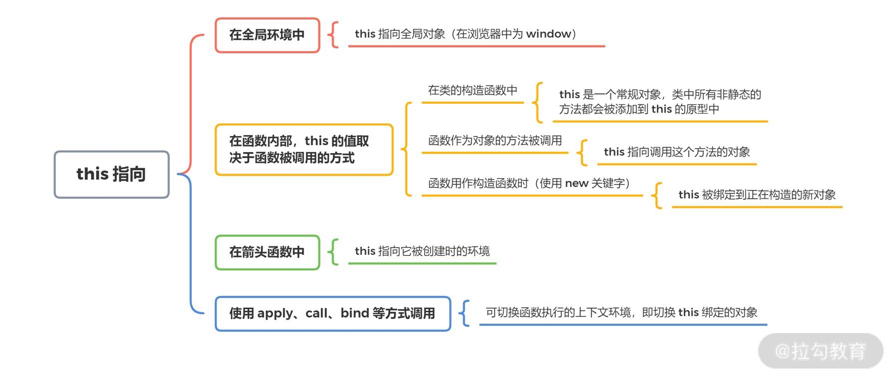

着重介绍 js 基础内容

<!--more-->

## 基础

`JavaScript` 是 Web 的编程语言。

在 html 文件中引入有两种方式：
1. 使用 `script` 标签。浏览器会解释并执行位于 `<script>` 和 `</script>`之间的 JavaScript 代码
2. 把脚本保存到外部文件中。外部文件通常包含被多个网页使用的代码。文件扩展名是 .js。在 `script` 标签的 "src" 属性中设置该 .js 文件
<i class="tips">Tips:</i>浏览器加载html文件时是一边下载html一边解析，发现`script`元素，就暂停解析。js引擎执行完毕再恢复往下解析 HTML 网页。所以一般情况下script标签放到html页面底部

JavaScript 使用关键字 `var` 来定义变量， 使用等号来为变量赋值：

```javascript
var num = 1
var text = 'text'
```

### 操作符

| 类型| 实例| 描述|
| - | - | - |
| 赋值运算符 | = += -= \*= /= %=|
| 算术运算符 | + - \* / % ++ -- + -|共提供10个算术运算符，用来完成基本的算术运算
| 比较运算符 | == === != !== > < >= <= |一共提供了8个比较运算符
| 逻辑运算符 | &&  \|\| ！ | 
| 条件运算符 | ?:| 三目运算符 vari=(condition)?value1:value2 |

### 语句

#### 条件语句

- if 语句 - 只有当指定条件为 true 时，使用该语句来执行代码
- if...else 语句 - 当条件为 true 时执行代码，当条件为 false 时执行其他代码
- if...else if....else 语句- 使用该语句来选择多个代码块之一来执行
- switch 语句 - 使用该语句来选择多个代码块之一来执行

#### 循环语句

- for - 循环代码块一定的次数
- for/in - 循环遍历对象的属性
- while - 当指定的条件为 true 时循环指定的代码块
- do/while - 同样当指定的条件为 true 时循环指定的代码块

## 数据类型

### 基础概念

js 数据基础类型有以下 6 类：

1. 基本类型：String、Number、Boolean、Null、Undefined
2. 引用数据类型：Object。其中包括 Object,Array,Function

ES6 引入了一种新的原始数据类型:Symbol,表示独一无二的值。

### 判断数据类型

1. typeof,简易情况下常用方法

```javascript
typeof 1 //'number'
typeof '1' //'string'
typeof true //'boolean'
typeof undefined //'undefined'
typeof null //'object'
typeof {} //'object'
typeof [] //'object'
typeof function a() {} //'function'
```

2. instanceof 用的不多，就不介绍了。

3. Object.prototype.toString.call():复杂情况下解决方法

```javascript
Object.prototype.toString.call(1) //"[object Number]"
Object.prototype.toString.call('1') //"[object String]"
Object.prototype.toString.call(true) //"[object Boolean]"
Object.prototype.toString.call([]) //"[object Array]"
Object.prototype.toString.call({}) //"[object Object]"
Object.prototype.toString.call(undefined) //"[object Undefined]"
Object.prototype.toString.call() //"[object Undefined]"
Object.prototype.toString.call(function a() {}) //"[object Function]"
```
### 类型详解

#### 数字(Number)

所有数字都是以64位浮点数形式储存，所以，1与1.0是相同的，是同一个数。
```javascript
//返回可以表示的具体的最大值和最小值。
Number.MAX_VALUE // 1.7976931348623157e+308
Number.MIN_VALUE // 5e-324

//默认情况下，JavaScript 内部会自动将八进制、十六进制、二进制转为十进制
0xff // 255
0o377 // 255
```

`NaN`:表示“非数字”（Not a Number）。NaN不等于任何值，包括它本身。
```javascript
NaN === NaN // false
```
`Infinity`:表示“无穷”。
```javascript
//Infinity有正负之分，Infinity表示正的无穷，-Infinity表示负的无穷。
Infinity === -Infinity // false

1 / -0 // -Infinity
-1 / -0 // Infinity
```

> 常用方法

| 方法名     | 描述| 备注 |
| - | - | - |
| toFixed(x) | 把数字转换为字符串，结果的小数点后有指定位数的数字 | num.toFixed(2)     |
| toString() | 把数字转换为字符串，使用指定的基数。默认十进制     |num.toString(2) ;num.toString(8)  
| isNaN()   | 检查某个值是否是数字。 |isNaN(NaN)//true;
| parseInt()<br>parseFloat() | 解析一个字符串并返回一个数值 |
|isFinite()|返回一个布尔值，表示某个值是否为正常的数值。|见下

```javascript
//除了Infinity、-Infinity、NaN和undefined这几个值会返回false，isFinite对于其他的数值都会返回true。
isFinite(Infinity) // false
isFinite(-Infinity) // false
isFinite(NaN) // false
isFinite(undefined) // false
isFinite(null) // true
isFinite(-1) // true
```

#### 字符串（String）

```javascript
var attr = 'jsString'
```

> 常用方法

| 方法名| 描述| 备注|
| - | - | - |
| concat()               | 连接两个或更多字符串，并返回新的字符串。| `var a='x';var b=a.concat('y');<br>a;//"x" b;//"xy"` |
| replace()              |替换匹配的子字符串||
| split()                |按照特定分隔符分隔字符串，返回数组|'a,b,c'.split(',');//["a", "b", "c"]|
| substr(startIndex,num) | 从起始索引号提取字符串中指定数目的字符。||
| substring(from,to)     | 提取字符串中介于两个指定下标之间的字符,返回的子串包括 开始 处的字符，但不包括 结束 处的字符。 ||
| trim()                 | 去除字符串两端的空格||
| match()                | 确定原字符串是否匹配某个子字符串，返回一个数组|成员为匹配的第一个字符串
| search()               | 返回值为匹配的第一个位置| 
| btoa()<br>atob()       | 任意值转为 Base64 编码<br>Base64 编码转为原来的值|不适合非 ASCII 码的字符

```javascript
var string = 'Hello World!';
btoa(string) // "SGVsbG8gV29ybGQh"
atob('SGVsbG8gV29ybGQh') // "Hello World!"

//将非 ASCII 码字符转为 Base64 编码,中间插入一个转码环节
function b64Encode(str) {
  return btoa(encodeURIComponent(str));
}

function b64Decode(str) {
  return decodeURIComponent(atob(str));
}

b64Encode('你好') // "JUU0JUJEJUEwJUU1JUE1JUJE"
b64Decode('JUU0JUJEJUEwJUU1JUE1JUJE') // "你好"
```

#### 布尔(Boolean)

布尔（逻辑）只能有两个值：true 或 false。

```javascript
//使用！！可以快速判断数据布尔值,下面六个值被转为false，其他值都视为true。
!!false //false
!!'' //false
!!0 //false
!!NaN //false
!!null //false
!!undefined //false

//以下几种情况不要误认为false
!!'0' //true
!![]//true
!!{}//true
```

#### 空（Null）、未定义（Undefined)

```javascript
//判断
undefined == null //true
undefined ===null + //false

// 转成数字
null + //0
undefined //NaN
```

#### 引用类型


##### 对象(Object)

```javascript
// 定义
var person={
  firstname:"John",
  lastname:"Doe",
  id:5566
};
//访问对象属性
1. person.firstname
2. person['firstname']
```
> 方法

Object():可以当作工具方法使用，将任意值转为对象。
```javascript
var obj = Object(1);
obj instanceof Object // true
obj instanceof Number // true

var arr = [];
var obj = Object(arr); // 返回原数组
obj === arr // true

//判断变量是否为对象的函数
function isObject(value) {
  return value === Object(value);
}
```

Object.keys():用来遍历对象的属性,只返回可枚举的属性
```javascript
var obj = {
  p1: 123,
  p2: 456
};

Object.keys(obj) // ["p1", "p2"]
```

Object.getOwnPropertyNames():用来遍历对象的属性,还会返回不可枚举的属性名
```javascript
var obj = {
  p1: 123,
  p2: 456
};

Object.getOwnPropertyNames(obj) // ["p1", "p2"]
```

ES5中，Object大部分都是实例方法。使用率不是特别高。简单介绍几个常用的方法的使用场景。

Object.prototype.toString()
```javascript
//封装返回变量数据类型
var dataType = function (o){
  var s = Object.prototype.toString.call(o);
  return s.match(/\[object (.*?)\]/)[1].toLowerCase();
};
```

Object.prototype.hasOwnProperty()：实例对象自身是否具有该属性。
```javascript
var obj = {
  p: 123
};
obj.hasOwnProperty('p') // true
obj.hasOwnProperty('toString') // false
```

##### 数组(Array)

```javascript
//常见三种定义数组方式
1. var cars=["Saab","Volvo","BMW"];
2. var cars=new Array("Saab","Volvo","BMW");
3. var cars=new Array();//或 var cars=[];
   cars[0]="Saab";
   cars[1]="Volvo";
   cars[2]="BMW";

var arr = [1, 2, 3];
typeof arr // "object";本质上，数组属于一种特殊的对象。typeof运算符会返回数组的类型是object。
Array.isArray(arr) // true;弥补typeof运算符的不足。
```

> 常用方法

更全面的列表见：[戳这里~](https://developer.mozilla.org/en-US/docs/Web/JavaScript/Reference/Global_Objects/Array)

| 方法名| 描述| 备注 |兼容性
| - | - | - | - |
| concat()           | 连接两个或更多的数组，并返回结果。|原数组不变|√
| slice(start,end)   | 返回选定的元素|不会改变原始数组|√
| splice(start, count, addElement1, addElement2,) |删除或添加元素<br>第二个参数为0表示添加|会改变原数组|√
| reverse()          | 颠倒排列数组元素|改变原数组|√
| sort()             | 排序|原数组将被改变|√
| push()<br>pop()    | 向数组的末尾添加一个或更多元素，并返回新的长度。<br>删除数组的最后一个元素并返回删除的元素。 |会改变原数组|√
| shift()<br>unshift | 删除并返回数组的第一个元素。<br>向数组的开头添加一个或更多元素，并返回新的长度。|会改变原数组|√
| join()             | 把数组的所有元素放入一个字符串。|如果不提供参数，默认用逗号分隔。|√
| map()              | 遍历数组<br>arr.map(function(elem, index, arr) {})| | ie9+
| forEach()          | 遍历数组<br>arr.forEach(function (elem, index, arr) {})|  没有返回值。| ie9+
| filter()           | 过滤数组成员,参数是一个函数<br>arr.filter(function (elem, index, arr) {})|不会改变原数组|ie9+
| some()<br>every()  | 返回一个布尔值,判断数组成员是否符合某种条件||ie9+
| reduce()<br>reduceRight()|依次处理数组的每个成员，最终累计为一个值<br>arr.reduce(function(prev,cur,index,arr){},initVal)||ie9+
| indexOf()<br>lastIndexOf()|返回给定元素在数组中第一次出现的位置，<br>返回给定元素在数组中最后一次出现的位置<br>如果没有出现则返回-1。|不能用来搜索NaN的位置| ie9+

##### 函数(Function)

```javascript
//函数表达式
var func = function() {
  ...
}
//function 命令
//采用function命令声明函数时，整个函数会像变量声明一样，被提升到代码头部
function func(){
  ...
}
```

> 函数作用域

在 ES5 的规范中，JavaScript 只有两种作用域：一种是全局作用域，变量在整个程序中一直存在，所有地方都可以读取；另一种是函数作用域，变量只在函数内部存在。ES6 又新增了块级作用域，暂不涉及。
函数执行时所在的作用域，是定义时的作用域，而不是调用时所在的作用域。

> 立即调用函数(IIFE)

两种写法都是以圆括号开头,最后的分号都是必须的
```javascript
(function(){ /* code */ }());
// 或者
(function(){ /* code */ })();
```

> eval

eval命令接受一个字符串作为参数，并将这个字符串当作语句执行。
```javascript
eval('var a = 1;');
a; // 1
```
eval的本质是在当前作用域之中，注入代码。由于安全风险和不利于 JavaScript 引擎优化执行速度，所以一般不推荐使用。遇到的两个使用场景如下：
```javascript
// 1. 处理不规范的json字符串。JSON.parse会报错.
var str="{'x':1,'y':2}";
JSON.parse(str);//报错。 
eval('('+str+')');//{x: 1, y: 2}

//2. 不推荐，但也是一种解决方案吧。
var arr=[1,2,3,4,5];
eval(arr.join('+'));//15
```

#### 全局对象

除了基础的 6 种数据类型，还有几类额外的全局对象类型，大致了解一下。

##### Date

日期对象用于处理日期和时间。

```javascript
var date = new Date()
typeof date //'object'
Object.prototype.toString.call(date) //"[object Date]"
```

摘选常用的方法讲解，全部清单见：[链接~](https://www.runoob.com/jsref/jsref-obj-date.html) ; get 方法都一一对应 set 方法，不赘述。

| 方法名        | 描述                               | 备注                      |
| ------------- | ---------------------------------- | ------------------------- |
| getFullYear() | 以四位数字返回年份                 | date.getFullYear();//2019 |
| getMonth()    | 返回月份 (0 ~ 11)                  | date.getMonth();          |
| getDate()     | 返回一个月中的某一天 (1 ~ 31)      | date.getDate();           |
| getDay()      | 返回一周中的某一天 (0 ~ 6)         | date.getDay();            |
| getHours()    | 返回小时 (0 ~ 23)                  | date.getHours();          |
| getMinutes()  | 返回分钟 (0 ~ 59)                  | date.getMinutes();        |
| getSeconds()  | 返回秒数 (0 ~ 59)                  | date.getSeconds();        |
| getTime()     | 返回 1970 年 1 月 1 日至今的毫秒数 | date.getTime();或者+date; |

##### Math

Math 对象用于执行数学任务。Math 对象并不像 Date 和 String 那样是对象的类，因此没有构造函数 Math()。

```javascript
var math = Math
typeof math //'object'
Object.prototype.toString.call(math) //"[object Math]"
```

摘选常用的方法讲解，全部清单见：[链接~](https://www.runoob.com/jsref/jsref-obj-math.html)

| 方法名           | 描述                      | 备注                                           |
| ---------------- | ------------------------- | ---------------------------------------------- |
| max(x,y,z,...,n) | 求最大值                  | Math.max(1,2,7,3); //7                         |
| min(x,y,z,...,n) | 求最小值                  | Math.min(1,2,7,3); //1                         |
| random()         | 返回 0 ~ 1 之间的随机数。 | Math.random();                                 |
| abs(x)           | 返回 x 的绝对值。         | Math.abs(-1);//1                               |
| ceil(x)          | 对 x 进行向上取整。       | Math.ceil(4.1);//5<br>Math.ceil(4.6);//5       |
| floor(x)         | 对 x 进行向下取整。       | Math.floor(4.1);//4<br>Math.floor(4.6);//4     |
| round(x)         | 四舍五入                  | Math.round(4.1);//4<br>Math.round(4.6);//5<br> |

#### JSON

复合类型的值只能是数组或对象，不能是函数、正则表达式对象、日期对象。

原始类型的值只有四种：字符串、数值（必须以十进制表示）、布尔值和null（不能使用NaN, Infinity, -Infinity和undefined）。

字符串必须使用`双引号`表示，不能使用单引号。

对象的键名必须放在`双引号`里面。

数组或对象最后一个成员的后面，不能加逗号。

### 类型转换

> Number():使用Number函数，可以将任意类型的值转化成数值。

除此之外，一般还会使用`parseFloat()`,`parseInt()`,`+`完成类似功能，但严谨度不太一样。下面列举具体的情况:

| 转换前 | Number() | parseFloat() | parseInt() | +val
| - | - | - | - | - |
| '123' | 123 | 123 | 123 | 123 |
| '123a' | NaN | 123 | 123 | NaN |
| '' | 0 | NaN | NaN | 0 |
| true | 1 | NaN | NaN | 1 |
| false | 0 | NaN | NaN | 0 |
| undefined | NaN | NaN | NaN | NaN |
| null | 0 | NaN | NaN | 0 |
| [] | 0 | NaN | NaN | 0 |
| [2] | 2 | 2 | 2 | 2 |
| [2,3] | NaN | 2 | 2 | NaN |
| {} | NaN | NaN | NaN | NaN |

> String():使用String函数，可以将任意类型的值转化成字符串

| 转换前 | String() | +'' | 
| - | - | - |
| 'abc'|'abc'|'abc'
| 123|'123'|'123'
| true|'true'|'true'
| null|'null'|'null'
| undefined|'undefined'|'undefined'
| []|''|''
| [1,2]|"1,2"|'1,2'
| [{'x':1}]|"[object Object]"|"[object Object]"
| {'x':1}|"[object Object]"|"[object Object]"


> Boolean():使用Boolean函数，可以将任意类型的值转为布尔值。

使用`!!`可以快速达到类似效果。只有上面5种情况是返回false的。

| 转换前 | Boolean() | !!val | 
| - | - | - |
| ''|false|false
| null|false|false
| 0|false|false
| undefined|false|false
| NaN|false|false
| '0'|true|true
| []|true|true
| {}|true|true
| new Boolean(false)|true|true


## DOM

### 基础

DOM (Document Object Model):文档对象模型，是 HTML 和 XML 文档的编程接口。HTML DOM 定义了访问和操作 HTML 文档的标准方法。DOM 以树结构表达 HTML 文档。所有 DOM 节点对象都继承了 Node 接口，拥有一些共同的属性和方法。这是 DOM 操作的基础。

<!--  -->


### 节点

在 HTML DOM (Document Object Model) 中 , 每一个元素都是 节点。Document 对象是 HTML 文档的根节点。Document 对象使我们可以从脚本中对 HTML 页面中的所有元素进行访问。

document节点对象代表整个文档，每张网页都有自己的document对象。window.document属性就指向这个对象。只要浏览器开始载入 HTML 文档，该对象就存在了，可以直接使用。

基础了解

| 节点 | nodeType | 对应常量 | nodeName | nodeValue(可读写)
| - | - | - | - | - |
| 文档节点（document）| 9 | Node.DOCUMENT_NODE | "#document" | null
| 元素节点（element) | 1 | Node.ELEMENT_NODE | 大写的标签名 | null
| 属性节点（attr） | 2 | Node.ATTRIBUTE_NODE | 属性的名称 | '...'
| 文本节点（text）| 3 | Node.TEXT_NODE | '#text' | '...'
| 文档片断节点（DocumentFragment) | 11 | Node.DOCUMENT_FRAGMENT_NODE | '#document-fragment'| null
| 文档类型节点（DocumentType） | 10 | Node.DOCUMENT_TYPE_NODE | 文档的类型| null
| 注释节点（Comment）| 8 | Node.COMMENT_NODE | '#comment' | '...'


DOM 提供两种节点集合，用于容纳多个节点

> NodeList:可以包含各种类型的节点。

length 、forEach() 、item()、keys()、values()、entries()

> HTMLCollection:只能包含 HTML 元素节点。

length、只能使用for循环遍历、item()、namedItem()


### js和jquery操作

```javascript
<div id="box" attr1 onclick="clickHandle();"></div>
var elem=document.getElementById('box');
```

| 功能 | js | jquery |
| - | - | - |
|<b>获取元素</b>|
| 获取指定id的元素 | document.getElementById('box') | $('#box') |
| 获取指定class的元素 | document.getElementsByClassName('box') | $('.box) |
|<b>样式</b>||
| 获取指定样式 | getComputedStyle(elem).height | $('#box').css('height') |
| 设置指定样式 | elem.style.height='50px' | $('#box').css('height','50px') |
|<b>属性</b>|
| 获取指定属性 | elem.getAttribute('attr1') | $('#box').attr('attr1') |
| 设置指定属性 | elem.setAttribute('attr1','attr1Value') | $('#box').attr('attr1','attr1Value') |
|<b>事件</b>|
| 绑定事件 | functin clickHandle(){}<br>elem.onclick=clickHandle;<br>elem.addEventListener("click",clickHandle,false); | $('#box','click',clickHandle) |

## 高阶
### 高阶函数
1. 接收一个函数或者多个函数作为参数的函数,如js中自带的map some every filter reduc
2. 函数执行返回一个函数，如bind
js自带的高阶函数栗子

函数柯里化
利用闭包保存的作用，把一些信息预先存储起来，[预处理]，供其下级上下文中后期使用。我们把这种预先存储/预先处理的机制称之为 ------函数柯里化


### 闭包
JavaScript 有两种作用域：全局作用域和函数作用域。函数内部可以直接读取全局变量。但是，函数外部无法读取函数内部声明的变量。
```javascript
function f1() {
  var n = 123;
  function f2() {
    console.log(n);
  }
  return f2;
}

var result = f1();
result(); // 999

//函数f2就是闭包，即能够读取其他函数内部变量的函数。
```
可以把闭包简单理解成“定义在一个函数内部的函数”,可以“记住”诞生的环境
闭包的最大用处有两个，一个是可以读取函数内部的变量，另一个就是让这些变量始终保持在内存中，即闭包可以使得它诞生环境一直存在。


## 思考✨
> Javascript 的原型和继承
- 如何理解 Javascript 中的“一切皆对象” 
- 如何创建一个对象
- proto 与 prototype 的区别
> 对单线程 Javascript 的理解
- 单线程来源
- Web Workers 和 Service Workers 的理解
> 异步事件机制
- 为什么使用异步事件机制
- 在实际使用中异步事件可能会导致什么问题 
- 关于 setTimeout、setInterval 的时间精确性
> 作用域与闭包
- 请描述以下代码的执行输出内容（考察作用域）
- 什么场景需要使用闭包
- 闭包的缺陷
> this 与执行上下文
- 简单描述 this 在不同场景下的指向
- apply/call/bind 的使用
```
this 总是指向函数的直接调用者
如果有 new 关键字，this 指向 new 出来的实例对象
在事件中，this 指向触发这个事件的对象
IE 下 attachEvent 中的 this 总是指向全局对象 Window
箭头函数中，函数体内的this对象，就是定义时所在作用域的对象，而不是使用时所在的作用域的对象。
```
```
call、apply和bind是Function对象自带的三个方法，都是为了改变函数体内部 this 的指向。
apply 、 call 、bind 三者第一个参数都是 this 要指向的对象，也就是想指定的上下文；
apply 、 call 、bind 三者都可以利用后续参数传参；
bind 是返回对应 函数，便于稍后调用；apply 、call 则是立即调用 。
call 传入参数列表
apply 传入数组
```
<!--  -->
- 箭头函数与普通函数的区别
> 对 EventLoop 的理解
- 介绍浏览器的 EventLoop
- 宏任务（MacroTask）和微任务（MicroTask）的区别 
- setTimeout、Promise、async/await 在不同浏览器的执行顺序
> ES6/ES7相关的语法
- 手写代码实现Promise
```
- Promise的初始状态是pending
- 执行了resolve，Promise状态会变成fulfilled
- 执行了reject，Promise状态会变成rejected
- Promise只以第一次为准，第一次成功就永久为fulfilled，第一次失败就永远状态为rejected
- Promise中有throw的话，就相当于执行了reject
Promise有三种状态：
- pending：等待中，是初始状态
- fulfilled：成功状态
- rejected：失败状态
```
- 为什么要使用async、await
- 怎样让ES6/ES7代码可以跑在各个浏览器中（考察Babel与polyfill）
- 介绍下Set和Map数据结构
- Javascript是怎么实现let和const作用域的
